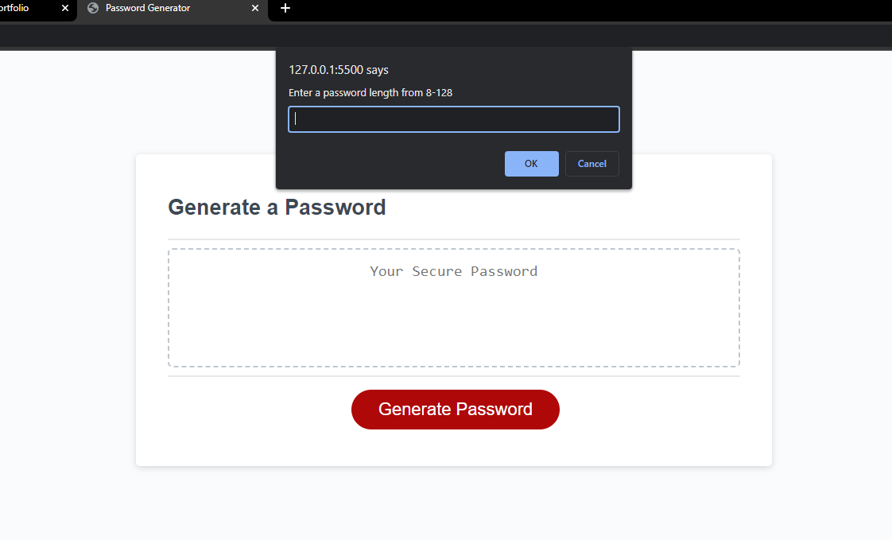
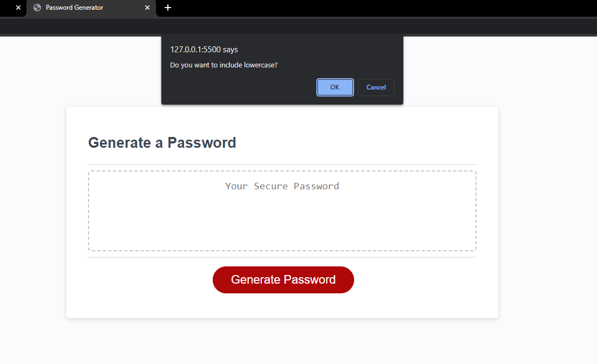
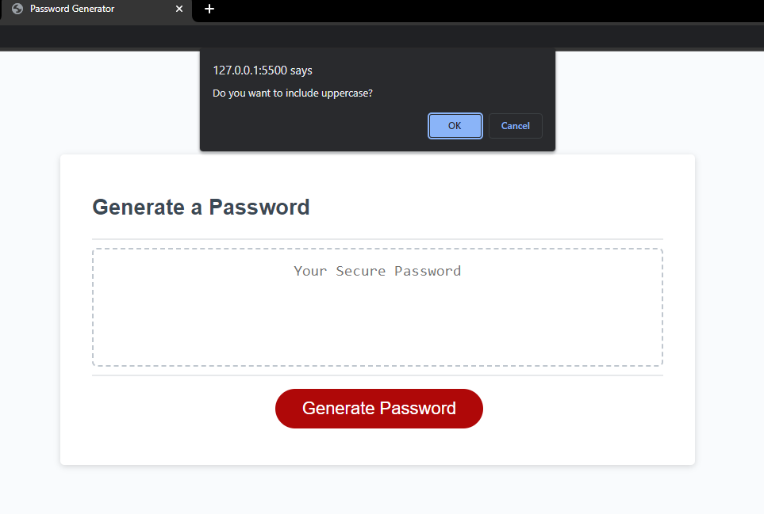
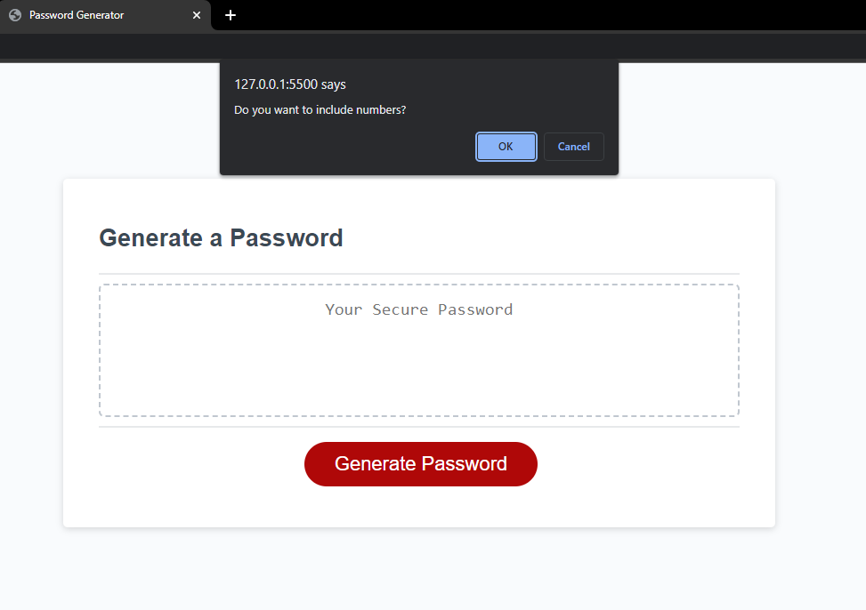
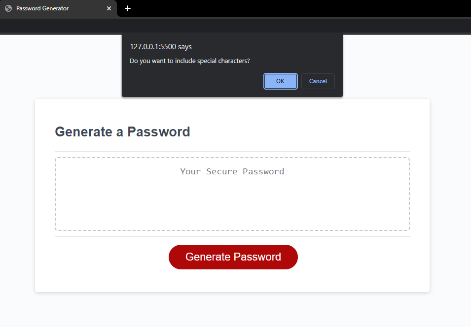
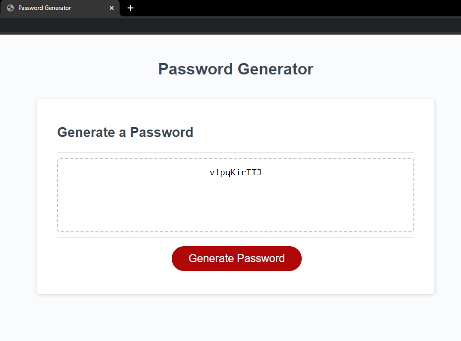

# JS-password-gen

## Description
My job was to debug this code and then add in software that would read user inputs and answers to prompts and make that data into a random password for them to use. 
The user is able to decide how many characters they want in their password. They have a range from 8-128 characters. Next they decide what kind of characters they want included.
The option are uppercase, lowercase, special characters, and numbers. After all these questions have been answered a password is randomly generated on screen for them.

## Installation
No install required

## Screenshot

## Deployed Link

